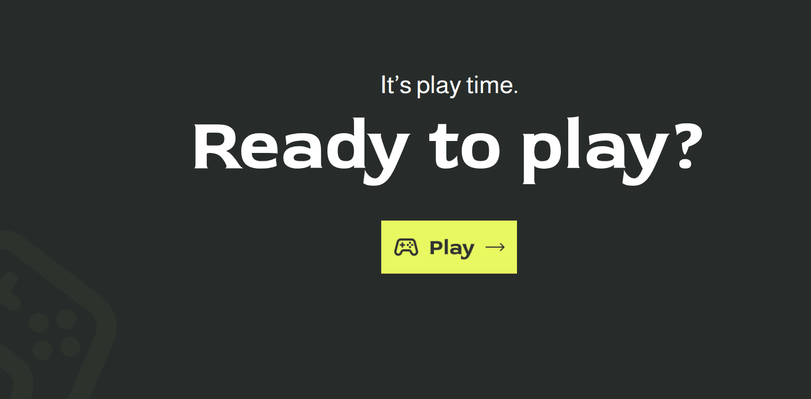
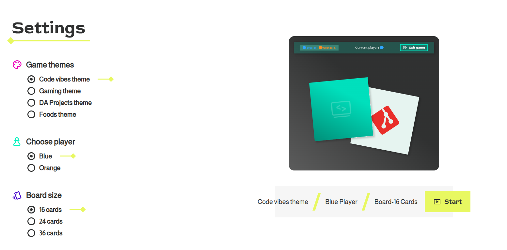
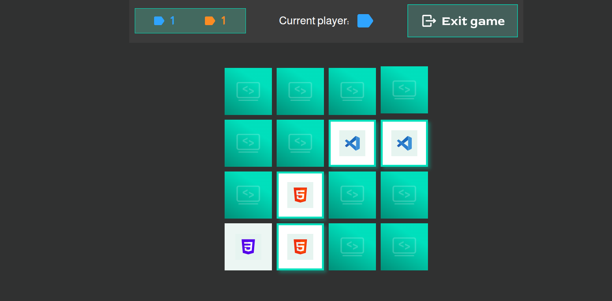
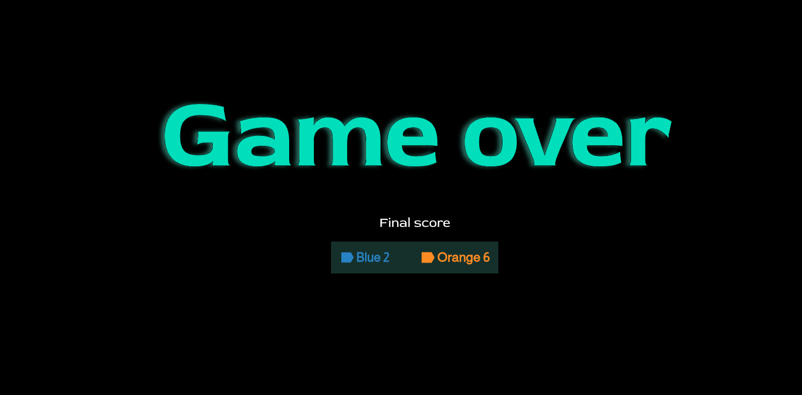
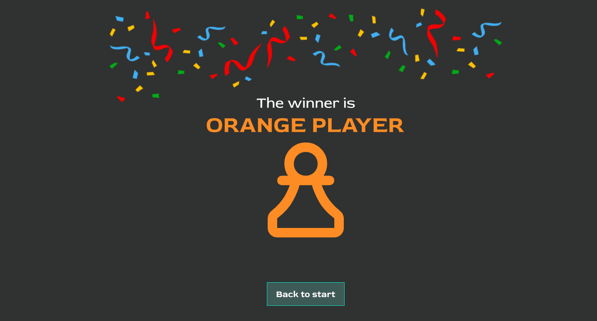
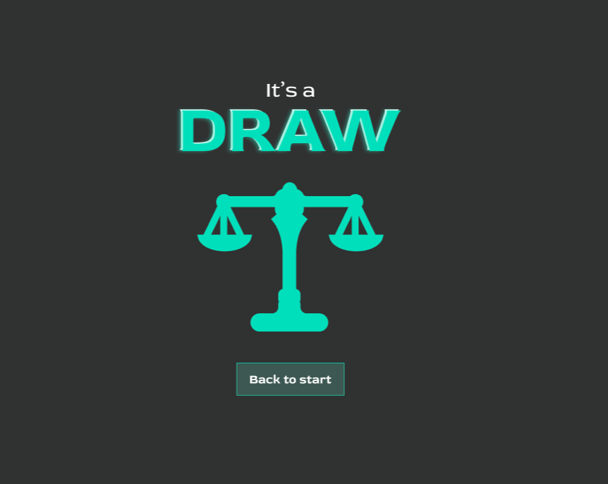

<div align="center">

# Memory

### A responsive two-player memory game built with TypeScript, SCSS and Vite

[Live Demo](https://obo-wan.github.io/Memory/) · [Source Code](https://github.com/OBO-WAN/Memory)

</div>

<p align="center">
  
</p>

## About

Memory is a browser-based card-matching game with a custom interface designed around several visual themes.

The current playable version includes the **Code Vibes** theme, configurable board sizes, alternating two-player turns, score tracking, animated card flips, matched-card feedback, and dedicated end-game overlays for a blue winner, orange winner, or draw.

## Features

- Two-player gameplay with blue and orange players
- Selectable starting player
- Three board sizes: 16, 24 and 36 cards
- Shuffled card pairs on every new game
- Animated card flipping
- Automatic comparison after two cards are revealed
- Non-matching cards flip back after a short delay
- Matching cards remain visible
- Current-player indicator and individual score counters
- Final-score, winner and draw overlays
- Exit confirmation dialog
- Responsive layout for desktop, tablet and mobile
- Reproducible favicon generation from an SVG source

## How to Play

1. Open the game and select **Play**.
2. Choose a theme, a starting player and a board size.
3. Reveal two cards.
4. A matching pair stays visible and earns the current player one point.
5. After a mismatch, the cards turn back and the other player takes the turn.
6. The player with the most pairs wins. Equal scores result in a draw.

## Screenshots

### Settings

Choose the theme, starting player and number of cards before beginning the game.

<p align="center">
  
</p>

### Gameplay

The Code Vibes board contains developer-themed card pairs, live scores and a current-player indicator.

<p align="center">
  
</p>

### Final Score

The completed game first displays the final score.

<p align="center">
  
</p>

### Winner and Draw Results

<table>
  <tr>
    <td width="50%">
      
    </td>
    <td width="50%">
      
    </td>
  </tr>
</table>

## Tech Stack

- **TypeScript** — game state, rendering and interaction logic
- **SCSS** — component-based responsive styling
- **Vite** — development server and production build
- **HTML** — semantic application structure
- **SVG** — cards, controls, overlays and interface assets

## Project Structure

```text
Memory/
├── docs/
│   └── images/
├── public/
│   ├── favicon.svg
│   ├── favicon.ico
│   ├── favicon-16x16.png
│   ├── favicon-32x32.png
│   ├── apple-touch-icon.png
│   └── site.webmanifest
├── scripts/
│   └── generate-favicons.mjs
├── src/
│   ├── assets/
│   │   ├── icons/
│   │   ├── images/
│   │   │   ├── cards/
│   │   │   ├── game-over/
│   │   │   └── result-overlay/
│   │   └── themes/
│   ├── scripts/
│   │   ├── data/
│   │   ├── game/
│   │   ├── state/
│   │   ├── types/
│   │   ├── ui/
│   │   └── app.ts
│   ├── styles/
│   │   ├── abstracts/
│   │   ├── base/
│   │   ├── components/
│   │   ├── pages/
│   │   └── main.scss
│   └── main.ts
├── index.html
├── package.json
├── tsconfig.json
└── vite.config.ts
```

## Local Development

### Requirements

- Node.js
- npm

### Installation

```bash
git clone https://github.com/OBO-WAN/Memory.git
cd Memory
npm install
npm run dev
```

Vite will print the local development URL in the terminal.

### Production Build

```bash
npm run build
```

### Preview the Production Build

```bash
npm run preview
```

## Favicons

`public/favicon.svg` is the editable master icon.

Regenerate the PNG and ICO favicon assets with:

```bash
npm run favicons
```

The generated assets are stored in `public/`.

## Current Status

The **Code Vibes** theme is playable.

The project already includes the complete gameplay loop:

- settings
- shuffled board generation
- two-player turns
- pair matching
- score tracking
- final score
- winner or draw result
- return to start

Additional theme assets are being prepared for future versions.

## Planned Themes

- Gaming
- DA Projects
- Foods

## Design Goals

- Clear and accessible game flow
- Strong visual feedback
- Reusable theme architecture
- Responsive behavior across screen sizes
- Maintainable TypeScript and SCSS structure
